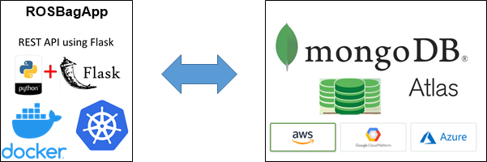

## ROSBagApp

It's a demo REST API Web App for ingest, labeling, store and explore  
[ROSBag](http://wiki.ros.org/rosbag) files.  
Demo solution is based on Python + FLask as a FrontEnd and MongoDB with GridFS  
as a Backend store.  


ROSBagApp is build on top of [ROS Melodic](http://wiki.ros.org/melodic) distribution.

The rosbag files witch are sended to ROSBagApp are analyzed. General type and topic info 
is gathered. Each topic is extended by [Connection Header data](http://wiki.ros.org/ROS/Connection%20Header)
Some "common" Header fields are skiped. It could be change [here](https://github.com/lzalewsk/rosbagapp/blob/master/rosbagapp/api/routes.py#L46)
Rest of "unique" (user or ROS App developers) fields are gathered and grouped into arrays  
and are stored in "topic"->"header_data" subtree.

```json
 "topics": [
            {                
                "header_data": {
                    "app": [
                        "test"
                    ],
                    "callerid": [
                        "/talker_ch"
                    ],
                    "cookies": [
                        "oreo"
                    ]
                },
                "messages": 141,
                "topic": "/chatter",
                "type": "std_msgs/String"
            },

```
For each rosbag file - description is stored in `rosbagfiles` mongo collection.  
Source (rosbag *.bag file) is stored on GridFS.

Using first verstion of REST API is it possible to store files in MongoDB,  
query and find rosbag files using "mongo QL" and download files from GridFS.

<b> REMARK </b>:  In case of huge amount of files is it necessary to consider 
sharding and proper collection indexing. (For further study and depends on needs...)
 
#### How to run the code
You may build from source
```
git clone https://github.com/lzalewsk/rosbagapp.git
cd rosbagapp
docker build --rm -t lzalewsk/rosbagapp .
```
or use image from Docker Hub  
Container run:  
```
docker run -itd --name rosbagapp \
    -e MONGO_USER=<auth_user> \
    -e MONGO_PASSWORD=<auth_password> \
    -e MONGO_SERVER=<mongodb_server_url> \
    -p 5000:5000 \
    lzalewsk/rosbagapp
```
or using CONNECTION_STRING i.e to Mongo Atlas
```
docker run -itd --name rosbagapp \
    -e MONGO_CONNECTION_STRING="mongodb+srv://<...>" \
    -p 5000:5000 \
    lzalewsk/rosbagapp
```

#### simple API usage by example

##### Storing ROSBag files:    
```
curl -F file=@<rosbag_file_name.bag> http://127.0.0.1:5000/api/file-upload
```

##### Explore ROSBag files.
All data without filtering:
```
curl -d '{}' -H 'Content-Type: application/json' -X POST http://127.0.0.1:5000/api/rosbagfiles | python -m json.tool |less
```
by default output is limited to 20 records.  
It could be change by adding "limit" to JSON query.
```
curl -d '{"limit":50}' -H 'Content-Type: application/json' -X POST http://127.0.0.1:5000/api/rosbagfiles | python -m json.tool |less
```
and "skip" field.
```
curl -d '{"limit":50, "skip":10}' -H 'Content-Type: application/json' -X POST http://127.0.0.1:5000/api/rosbagfiles | python -m json.tool |less
```

Output content could be defined by "projection" filed according to Mongo [doc](https://docs.mongodb.com/v3.2/tutorial/project-fields-from-query-results/)
For example: output limited only to "file_name_iid", "path", "start"
```
curl -d '{"projection": {"_id":0,"file_name_iid":1,"start":1,"path":1},"limit":2,"skip":3}' -H 'Content-Type: application/json' -X POST http://127.0.0.1:5000/api/rosbagfiles | python -m json.tool |less
```

*** DATA FILTERING ***  
Filtering is made according to [MongoDB Query operations](https://docs.mongodb.com/v3.2/reference/method/db.collection.find/#db.collection.find)
Query JSON shall be put as value of "filter" key.  
```
curl -d '{"filter": { "$and": [{"start": {"$gte":"2019-12-26T00:00:00"}},{"start": {"$lte":"2019-12-28T00:00:00"}}] },"projection":{"_id":0,"start":1,"file_name_iid":1}}' -H 'Content-Type: application/json' -X POST http://127.0.0.1:5000/api/rosbagfiles |python -m json.tool
```
For example, If we want to find all rosbag files where in Header the "oreo" cookies was used
then following filtering criteria we may use:   
```
curl -d '{"filter": {"topics.header_data.cookies":"oreo"} ,"projection":{"_id":0,"start":1,"file_name_iid":1}}' -H 'Content-Type: application/json' -X POST http://127.0.0.1:5000/api/rosbagfiles |python -m json.tool
```

##### Downloading ROSBag files.
Stored rosbag files could be downloaded from Mongo GridFS using i.e wget by "file_name_iid"  
```
wget http://127.0.0.1:5000/api/getfile/9a8cdbc8-6975-4d12-84ef-ba931f61eb33.bag
```
or using curl
```
curl -o demo.bag http://127.0.0.1:5000/api/getfile/9a8cdbc8-6975-4d12-84ef-ba931f61eb33.bag
```
